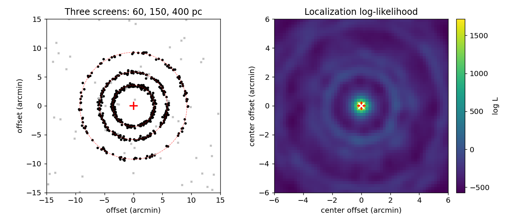
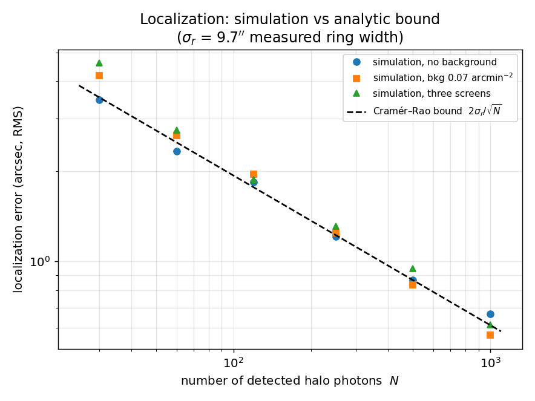
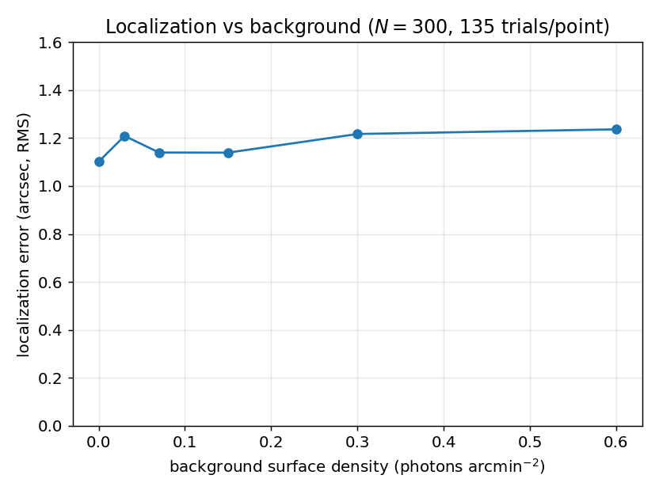
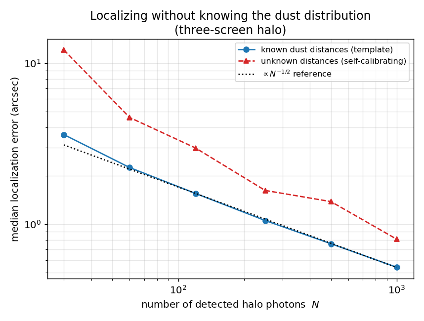

## Abstract

Nederlander & Paerels (2020) proposed that a prompt X-ray flash from a gravitational-wave (GW) source will scatter off Galactic dust and produce an expanding ring-shaped halo whose photons arrive hours to a day after the event, and whose geometric center pinpoints the source. Their treatment used two idealized dust geometries and asserted, without an explicit algorithm, that the halo center can be located to arcsecond precision. Here I (i) build a Monte-Carlo forward model of scattering halos for realistic line-of-sight dust distributions consisting of multiple discrete screens, which produce a set of concentric, differently expanding rings; (ii) implement an explicit maximum-likelihood centroiding estimator for the source position; and (iii) quantify the achievable localization precision with simulations. The recovered localization error scales as $N^{-1/2}$ with the number of detected halo photons $N$, reaching $\approx 4''$ at $N=30$ and $\approx 0.6''$ at $N=1000$, and saturates an analytic Cramér–Rao bound $2\sigma_r/\sqrt{N}$ set by the ring width $\sigma_r$ measured from the simulated halos. The precision is robust to a realistic soft X-ray background and is not degraded — indeed is marginally improved — when the halo comprises several nested rings from dust at different distances. I further show that the source can be localized *without* any prior knowledge of the dust distribution, using only the concentricity of the rings; that the same analysis tomographically recovers the distances to the intervening dust screens (60, 150, 400 pc recovered as 60, 151, 403 pc); that both properties survive realistic many-cloud Galactic sightlines (median localization error $1.3''$ over an ensemble of 50 random sightlines); and that the halo's $\sqrt{t}$ expansion between epochs measures the dust distances independently and rejects spurious detections. A short detectability analysis shows the ring is a $>5\sigma$ feature for a few tens of photons and is reliably localized for a few hundred, collapsing a $100$–$1000\ \mathrm{deg}^2$ GW skymap to a few square arcseconds. This confirms and sharpens the central claim of Nederlander & Paerels (2020): a detected scattering halo localizes its GW source finely enough to identify a unique host galaxy, and does so even when the foreground dust is unknown.

## 1. Introduction

Gravitational-wave observatories localize compact-binary mergers only coarsely — typically tens to hundreds of square degrees — which makes prompt identification of an electromagnetic (EM) counterpart difficult, as the follow-up campaign for GW170817 illustrated even in a favorable case (Abbott et al. 2017; Evans et al. 2017). For binary black-hole mergers, which are not expected to produce the neutron-star merger kilonova, any EM signal is likely to be a brief, faint flash that all-sky monitors may miss entirely. Determining a precise sky position is essential both for identifying the host galaxy (and hence the redshift, breaking distance–inclination degeneracies) and for triggering follow-up.

Nederlander & Paerels (2020, hereafter *NP20*) pointed out that if such an event emits X-rays, those photons will scatter off interstellar dust in our own Galaxy and generate a scattering halo — a phenomenon long observed around variable Galactic X-ray sources (e.g., Overbeck 1965; Mauche & Gorenstein 1986; Predehl et al. 2000; Vaughan et al. 2004; Tiengo & Mereghetti 2006; Heinz et al. 2015; Corrales 2015). Because scattered photons travel a slightly longer geometric path, they arrive with a delay of hours to a day, providing a "reprieve" in which the counterpart can still be found even if the prompt flash was missed. Crucially, the halo is a set of rings centered on the source direction, so its centroid recovers the source position with far greater precision than the GW localization.

NP20 developed the feasibility of this idea using two deliberately extreme dust geometries — a single thin screen at 100 pc and dust distributed uniformly to 100 pc — and estimated that the halo center could be located to of order $1''$–$10''$. They did not, however, model the clumpy, multi-cloud dust distribution that real sightlines present, nor did they construct and test an explicit localization algorithm. This paper addresses both gaps. Section 2 sets out the halo physics and a Monte-Carlo forward model that admits an arbitrary set of dust screens, together with a maximum-likelihood centroiding estimator. Section 3 presents simulated halos, a quantitative characterization of localization precision as a function of photon count, background, and dust geometry, a self-calibrating estimator that requires no prior dust model, a demonstration that the halo tomographically recovers the foreground dust distances, a realistic many-cloud Galactic sightline, and the halo's time evolution. Section 4 develops the detectability and a concrete search strategy. Section 5 discusses implications for host-galaxy identification and the limitations of the present treatment.

## 2. Method

### 2.1. Halo geometry and time delay

Consider a source at an effectively infinite (extragalactic) distance whose prompt X-rays illuminate a thin dust screen a distance $d$ from the observer, oriented perpendicular to the line of sight. A photon scattered through a small angle $\theta$ is observed at angular offset $\theta$ from the source direction and, having travelled a slightly longer path, arrives with a delay

$$ t = \frac{d}{2c}\,\theta^{2}, $$

so that at a fixed observation time $t$ after the flash the screen is seen as a ring of angular radius

$$ \theta_{\mathrm{ring}}(t,d) = \sqrt{\frac{2\,c\,t}{d}}. $$

For $d = 100$ pc this gives a ring radius of $7.0'$ at a delay of 6 hr, reproducing the value quoted by NP20. A nearer screen produces a larger, faster-expanding ring and a more distant screen a smaller, slower one; several screens along the same sightline therefore yield a set of concentric rings sharing a common center at the source position. During a finite exposure each ring has a small radial width set by the range of delay times sampled, and is further broadened by the telescope point-spread function (PSF).

### 2.2. Scattering cross section

In the Rayleigh–Gans regime the differential scattering cross section is approximately Gaussian in the scattering angle (Mauche & Gorenstein 1986; Draine 2011),

$$ \frac{d\sigma}{d\Omega} \propto \exp\!\left(-\frac{\theta^{2}}{2\,\theta_0^{2}}\right), \qquad \theta_0 = 10.4\left(\frac{E}{\mathrm{keV}}\right)^{-1}\!\left(\frac{a}{0.1\,\mu\mathrm{m}}\right)^{-1}\ \mathrm{arcmin}, $$

where $E$ is the photon energy and $a$ the characteristic grain radius. For $E = 1$ keV and $a = 0.1\,\mu$m, $\theta_0 = 10.4'$. This factor weights how many photons populate each ring: rings whose radius greatly exceeds $\theta_0$ are strongly suppressed. In the forward model each simulated photon is accepted with probability proportional to the cross section evaluated at the ring radius from which it originates. The Rayleigh–Gans approximation is known to overestimate the scattering below $\approx 1$ keV relative to the exact Mie solution (Smith & Dwek 1998), so the fiducial 1 keV case sits at the edge of its formal validity; because this modifies only the brightness weighting of the rings and not their geometry (Section 5), the localization results below are insensitive to it.

### 2.3. Forward model

The simulator takes a source position, a list of dust screens (each specified by distance, relative scattering optical depth, and grain size), a photon energy, an exposure window $[t_0, t_0 + t_{\mathrm{exp}}]$, a PSF width, and a uniform background surface density. For each halo photon it draws a parent screen (weighted by optical depth), a scattering time within the exposure window, and a random azimuth; computes the ring radius from Eq. (2); accepts the photon against the differential cross section at that radius (Section 2.2); and applies a Gaussian PSF blur. Background photons are drawn uniformly across the field. The output is a detected photon list — exactly the observable a real X-ray imager would deliver. Throughout I adopt a Gaussian PSF of dispersion $\sigma_{\mathrm{PSF}} = 0.15' = 9''$ (half-power diameter $\approx 0.35'$, comparable to the $0.3'$ of *Swift*/XRT, the instrument NP20 considered) and a $40' \times 40'$ field.

The framework accepts an arbitrary set of screens, so it can represent both the idealized cases used for validation and physically motivated sightlines. For the latter (Section 3.7) I generate cloud distances from an exponential disk-like profile and column densities (hence relative optical depths) from a log-normal distribution, and I draw grain radii per photon from a scattering-weighted size distribution: an MRN number law $n(a) \propto a^{-3.5}$ (Mathis, Rumpl, & Nordsieck 1977) combined with an X-ray scattering cross section $\sigma_{\mathrm{scat}} \propto a^{4}$ yields an effective $p(a) \propto a^{+0.5}$ over $0.05$–$0.25\,\mu$m, so that larger grains dominate the scattered flux; each photon is then accepted against the full differential cross section, whose $1/\theta_0^2 \propto a^2$ normalization further concentrates the large-grain contribution at small angles. Because the ring *radius* is fixed by geometry, the grain-size spread affects only the relative brightness of the rings, not their positions.

### 2.4. Maximum-likelihood localization

Given the detected photon list and the known ring template (fixed by the assumed screen distances and the exposure window), the only free parameters are the source coordinates $(x_c, y_c)$. I model the sky intensity as a mixture of the PSF-smeared ring template $s(r)$, evaluated at each photon's radius $r$ from the trial center, and a flat background $b$ with fractional weight $f$, and maximize the log-likelihood

$$ \ln \mathcal{L}(x_c,y_c) = \sum_{j} \ln\!\left[(1-f)\,s(r_j) + f\,b\right], \qquad r_j = \sqrt{(x_j-x_c)^2 + (y_j-y_c)^2}. $$

The radial template is precomputed once on a fine grid so that evaluating the likelihood at any trial center reduces to a single interpolation per photon; the best center is found by a coarse grid search followed by two stages of local refinement. This estimator uses only the ring geometry, not photon energies, and makes no assumption of a single ring — it applies unchanged to the multi-screen case.

### 2.5. The analytic localization limit

The precision achievable by *any* unbiased estimator is set by the Fisher information and does not depend on the particular algorithm. Consider a single ring of mean angular radius $\theta_0$ and radial width $\sigma_r$ (from the exposure duration and PSF), with photons distributed uniformly in azimuth. The probability density of one photon at position $(x,y)$ relative to the true center is

$$ p(x,y) = \frac{1}{2\pi r}\,\frac{1}{\sqrt{2\pi}\,\sigma_r}\exp\!\left[-\frac{(r-\theta_0)^2}{2\sigma_r^2}\right], \qquad r = \sqrt{x^2+y^2}. $$

Because $p$ depends on position only through $r$, and $\partial r/\partial x_c = -\cos\phi$, the Fisher information for the center coordinate $x_c$ per photon is $I_{xx} = \langle (\partial_{x_c}\ln p)^2\rangle = \langle\cos^2\phi\rangle\,\langle(\partial_r\ln p)^2\rangle$. With $\langle\cos^2\phi\rangle = 1/2$ and, for a thin ring ($\sigma_r \ll \theta_0$), $\langle(\partial_r\ln p)^2\rangle \simeq 1/\sigma_r^2$, this gives $I_{xx} = I_{yy} = 1/(2\sigma_r^2)$ per photon and $I_{xy}=0$. For $N$ photons the Cramér–Rao bound on the two-dimensional RMS localization error is therefore

$$ \Delta\theta_{\mathrm{loc}} \;=\; \sqrt{\mathrm{Var}(x_c)+\mathrm{Var}(y_c)} \;\ge\; \frac{2\,\sigma_r}{\sqrt{N}}. $$

The error is set by the ring *width* divided by $\sqrt{N}$, independent of the ring radius. Section 3.3 shows that the maximum-likelihood estimator saturates this bound.

## 3. Results

### 3.1. A single-screen halo

Figure 1 shows a simulated halo from a single screen at 100 pc observed in a 1300 s exposure beginning 6 hr after the flash, with 60 halo photons and a background of 0.07 photons $\mathrm{arcmin}^{-2}$ (about half the diffuse soft X-ray background rate NP20 adopt for this exposure; Section 3.4 shows the precision is insensitive to this choice over an order of magnitude). The scattered photons trace a clean ring at $7'$; the likelihood map peaks sharply at the true source position, which the estimator recovers to within an arcsecond.

### 3.2. Realistic multi-cloud halos

Real sightlines contain several discrete dust clouds. Figure 2 shows a halo from three screens at 60, 150, and 400 pc, which appear as concentric rings at $9.2'$, $5.8'$, and $3.6'$ respectively at a delay of $\approx 6$ hr. This nested-ring morphology is a qualitatively new prediction relative to the single- and uniform-screen cases of NP20, and it carries extra information: the set of ring radii at a given time encodes the line-of-sight dust distribution, while all rings remain centered on the source. The likelihood surface (right panel) shows the sharp central peak plus weaker concentric secondary maxima where pairs of rings can be mutually aligned; these are well separated from the true center and do not bias the recovered position.

### 3.3. Localization precision

To characterize the achievable precision I generated 120 independent realizations at each photon count and measured the RMS offset of the recovered center from the truth. Figure 3 and Table 1 give the results. The localization error falls from $\approx 4''$ at $N=30$ to $\approx 0.6''$ at $N=1000$ detected halo photons and tracks the Cramér–Rao bound of Section 2.5 almost exactly: measuring the ring width from the simulations gives $\sigma_r = 9.7''$, and the prediction $2\sigma_r/\sqrt{N}$ passes through the background-free single-screen points to within $\lesssim 10\%$ over the entire range (e.g., $1.22''$ predicted versus $1.21''$ measured at $N=250$). The bound is derived for one ring of width $\sigma_r$ observed without background, so the other two configurations are expected to sit slightly above it, and do: the agreement is within $\lesssim 10\%$ for $N \gtrsim 60$ but degrades at the sparsest count ($18\%$ and $30\%$ at $N=30$ for the background and three-screen cases), where occasional near-failures of the estimator inflate the RMS. The maximum-likelihood estimator is thus statistically efficient — it extracts essentially all the localization information in the halo. It is also unbiased and well-calibrated: over 220 realizations at $N=200$ the mean recovered offset is $0.09''$ (against a $\sim 1''$ scatter), the RMS matches the Cramér–Rao prediction to $8\%$, and $62\%$ of trials fall within the nominal $68\%$ error region — consistent with near-Gaussian errors only marginally broader than the ideal bound. A realistic background degrades the precision only mildly, and the three-screen halo localizes essentially as well as the single ring at the same total photon count: the photons are spread across more rings, but every ring constrains the same center, and the residual differences are within the Monte-Carlo sampling error.

: **Table 1.** RMS localization error (arcsec) versus detected halo photon count.

| $N$ (halo photons) | Single screen, no background | Single screen, bkg 0.07 $\mathrm{arcmin}^{-2}$ | Three screens, bkg 0.07 $\mathrm{arcmin}^{-2}$ |
|:---:|:---:|:---:|:---:|
| 30   | 3.5  | 4.2  | 4.6  |
| 60   | 2.3  | 2.6  | 2.8  |
| 120  | 1.8  | 2.0  | 1.9  |
| 250  | 1.2  | 1.3  | 1.3  |
| 500  | 0.87 | 0.84 | 0.95 |
| 1000 | 0.67 | 0.57 | 0.61 |

### 3.4. Robustness to background

Figure 4 fixes the halo at 300 photons and varies the background surface density over an order of magnitude (135 trials per point). The localization error is nearly flat, rising only from $\approx 1.1''$ in the background-free limit to $\approx 1.2''$ at $0.6$ photons $\mathrm{arcmin}^{-2}$ — several times the reference soft X-ray background. The ring is a strong geometric constraint: even when background photons outnumber halo photons across the field, the concentric structure fixes the center at the arcsecond level.

### 3.5. Localizing without knowing the dust distribution

The likelihood of Section 2.4 assumes the dust-screen distances are known, so that the ring radii can be predicted. In practice a sightline's dust distribution may be uncertain. I therefore also implemented a *self-calibrating* estimator that uses no distance information at all: it exploits only the fact that the rings are concentric about the source. For a trial center, each photon's radius is computed and a smoothed radial density is built from the data themselves (with the geometric $r\,dr$ area factor divided out so that a uniform background does not mimic a ring); the score is the summed log-density of the photons. The correct center is the one at which the radii pile up most sharply into rings. This estimator needs neither the screen distances nor the number of screens.

Figure 5 compares the two estimators for the three-screen halo. Once more than a few dozen photons are detected, the self-calibrating estimator tracks the distance-informed one to within a factor of $\approx 2$, and both follow the $N^{-1/2}$ scaling. The main penalty for discarding distance information appears at the sparsest photon counts: at $N=30$ (about ten photons per ring) the self-calibrating estimator fails catastrophically — locking onto a spurious center — in $\approx 22\%$ of trials, but no such failure occurs by $N=60$ (a rate $\lesssim 2\%$). The practical implication is that the source can be localized directly from the halo image alone, without an external dust model, provided the halo is more than marginally detected.

### 3.6. Halo tomography: recovering the dust distribution

A corollary of self-calibration is that, once the center is found, the radii of the recovered rings measure the line-of-sight dust distribution. Inverting the geometry, a ring of angular radius $\theta$ seen at delay $t$ corresponds to a screen at distance $d = 2ct/\theta^{2}$. Figure 6 shows this for the three-screen halo: the radial profile about the recovered center resolves three clean peaks, and converting their radii recovers screen distances of 60, 151, and 403 pc, against true values of 60, 150, and 400 pc. A scattering halo thus does double duty — it localizes the source *and* tomographically maps the intervening Galactic dust, a diagnostic that a single steady Galactic X-ray source cannot provide because it lacks a known flash time.

### 3.7. A realistic Galactic sightline

The three-screen case is a controlled test; a real sightline contains many clouds spread over a range of distances. Figure 7 shows a halo for a sightline drawn from the disk-and-log-normal model of Section 2.3 — eight clouds between 65 and 1021 pc, with a scattering-weighted grain-size distribution — imaged with 900 halo photons. The result is a superposition of many partly overlapping rings that merge into a structured, filled halo rather than a set of clean annuli. Two conclusions survive this complexity. First, localization survives: the self-calibrating estimator recovers the source to $2.2''$ with no knowledge of the eight cloud distances, because concentricity is a property of *all* the rings simultaneously. Second, tomography degrades gracefully: the dominant clouds are still recovered as distinct radial peaks (at 463 and 195 pc, against a true 437–489 pc pair and a cloud at exactly 195 pc), while closely spaced clouds blend into single peaks and the outermost rings — strongly suppressed by the scattering cross section — fall below the peak-detection threshold. Nor is this example a lucky draw: over an ensemble of 50 random sightlines generated from the same model (5–20 clouds each, same photon budget), the self-calibrating estimator achieves a median error of $1.3''$, a 90th-percentile error of $2.6''$, and a worst case of $3.4''$ — every sightline in the ensemble is localized to better than $5''$. A scattering halo therefore remains a clean localizer, and a coarse dust probe, even for a messy line of sight.

### 3.8. Time evolution and false-positive rejection

A scattering halo is a transient: because $\theta_{\mathrm{ring}} = \sqrt{2ct/d}$, each ring expands as the square root of the elapsed time. Figure 8 (left) images a single 100 pc screen at two epochs; the ring grows from $5.0'$ at 3 hr to $8.6'$ at 9 hr, a ratio of exactly $\sqrt{3}$. Figure 8 (right) tracks the recovered ring radii of the three-screen halo across six epochs from 2 to 12 hr; each ring follows its predicted $\sqrt{2ct/d}$ track, so the *rate* of expansion independently measures each cloud's distance. This time dependence is also a powerful discriminant against spurious halos: real scattered light expands about a fixed center between exposures, whereas background structure and instrumental artifacts do not. Requiring a coherent $\sqrt{t}$ expansion across two or more epochs therefore rejects false positives that a single image cannot.

## 4. Detectability and search strategy

Two questions determine whether the method is usable in practice: is the halo detectable above background, and, once detected, is it localized? Figure 9 (left) gives the detection significance of the ring for a single 100 pc screen, whose annulus (radius $7'$, width $\sim 1'$) subtends $\approx 44\ \mathrm{arcmin}^2$. Because the ring occupies a small area, the enclosed background is modest and the significance $S/\sqrt{S+B}$ exceeds $5\sigma$ for as few as $\approx 30$ photons in the annulus, only weakly dependent on the background level over the range considered. Figure 9 (right) shows the operational localization-success fraction — the fraction of trials localized to better than $5''$ by the self-calibrating estimator — as a function of detected photons. For a reference background of $0.07\ \mathrm{arcmin}^{-2}$ the success fraction reaches $\approx 90\%$ by $\sim 120$ photons and unity by $\sim 300$; a heavier background of $0.3\ \mathrm{arcmin}^{-2}$ shifts the curve to higher photon counts but the halo is still reliably localized once a few hundred photons are collected.

These numbers imply a concrete search strategy. Following an unlocalized GW trigger, a wide-field soft X-ray imager (e.g., a lobster-eye instrument of the Einstein Probe/WXT type, or an eROSITA-class survey telescope; Predehl 2017) should tile the (hundreds of square degree) skymap in short repeated exposures over the first day, seeking an extended, centrally symmetric excess. A candidate is confirmed by re-imaging: a genuine halo expands as $\sqrt{t}$ about a fixed center (Section 3.8), which rejects static false positives. Once confirmed, the center is obtained from the self-calibrating estimator with no external dust model, and the ring radii yield the foreground dust distances as a by-product. The pay-off is a dramatic shrinkage of the search region: locating the source to $\sim 1''$ collapses a $100$–$1000\ \mathrm{deg}^2$ GW skymap to a few square arcseconds, a reduction in area of $\sim 4\times10^{8}$–$4\times10^{9}$, which is what makes a unique host-galaxy identification possible.

### 4.1. Matched-filter detection and the trials factor

The annulus estimate above is deliberately conservative because it discards the ring's shape. The optimal linear detector is a matched filter: cross-correlating the image with the zero-mean radial ring template $T(r)$ gives a statistic $D(c) = \sum_j T(|x_j - c|)$ whose maximum over trial centers is the field's detection statistic. Under background alone the maxima cluster tightly (Figure 10, left), whereas even a faint halo of $N=60$ photons lands far into the tail. Fitting the background maxima with a Gumbel distribution (the appropriate extreme-value form for a maximum) and requiring a global false-alarm probability of $2.9\times10^{-7}$ (5$\sigma$) sets the detection threshold. Because a survey must tile many fields, the threshold rises with the number of independent fields $M$ — but only logarithmically. Figure 10 (right) shows that the halo photons needed for a global 5$\sigma$ detection grow from $\approx 17$ for a single field to just $\approx 24$ across $10^4$ tiled fields: the ring is such a distinctive template that the trials penalty of an all-sky search is mild. This assumes the ring radius — set by the unknown dust distance — is known; a real search runs a bank of templates spanning plausible distances, which multiplies the effective trials by the modest number of independent radii and leaves the required count at a few tens of photons. The matched filter is therefore somewhat more sensitive than the annulus estimate of the previous paragraph, and confirms that detection, like localization, is limited by photons rather than by background or survey size.

### 4.2. Expected performance for a fiducial event

The localization can be tied to a physical event using the photon budget of NP20. For a source at 400 Mpc emitting a fraction $\epsilon = 10^{-5}\epsilon_{-5}$ of the GW energy in soft X-rays, scattered by a 100 pc dust path and collected by a telescope of order $100\ \mathrm{cm}^2$ effective area (the *Swift*/XRT class NP20 considered), NP20 estimate $N \approx 4500\,\epsilon_{-5}$ halo photons integrated over the halo's roughly day-long observable lifetime. Exploiting this full budget requires combining exposures across epochs, which the estimator accommodates naturally, since the rings at every epoch share the same center (Section 3.8). Combining this with the localization law $\Delta\theta_{\mathrm{loc}} = 2\sigma_r/\sqrt{N}$ (Section 2.5) gives the expected precision as a function of the — highly uncertain — X-ray efficiency. Figure 11 shows the result, with the simulated points confirming the scaling. Even for an efficiency as low as $\epsilon_{-5} = 0.01$ (about 45 photons) the source is localized to $\approx 3''$, and for $\epsilon_{-5} \gtrsim 0.03$ to better than $5''$; across the whole plausible range the error lies far below the $\sim 35''$ mean separation between candidate host galaxies. The conclusion is encouraging: whenever the halo is detectable at all, it is localizable to the host-galaxy level. The binding uncertainty is astrophysical — whether black-hole mergers emit detectable X-rays — not the localization method.

## 5. Discussion

The practical question is whether the halo centroid pins down a *unique* host galaxy. At the design sensitivity of LIGO/Virgo, $30\,M_\odot$ black-hole binaries are detectable to $\approx 1.5$ Gpc; for a galaxy density of $\approx 10^{-2}\ \mathrm{Mpc}^{-3}$ the mean separation between candidate hosts in the relevant volume is tens of arcseconds (Chen & Holz 2016; NP20). The arcsecond-level localization found here is therefore more than sufficient to isolate a single host in the large majority of cases, confirming the central claim of NP20 with an explicit algorithm and a quantified error budget.

Two themes run through these results. The first is robustness: the localization is essentially unchanged by a realistic eight-cloud sightline (Section 3.7), by soft X-ray background (Section 3.4), and by discarding all prior knowledge of the dust (Section 3.5), because concentricity is a global property of the whole halo rather than of any one ring. The second is that the foreground dust — normally a nuisance — becomes information: the ring radii measure the screen distances (Section 3.6), and their $\sqrt{t}$ expansion both confirms the transient nature of the signal and rejects static false positives (Section 3.8), underpinning the search strategy of Section 4.

Two points of physics are worth clarifying. The ring radius at a fixed delay, $\theta = \sqrt{2ct/d}$, follows from the geometric path-length difference and is therefore independent of photon energy; energy enters only through the scattering cross section, which sets how *bright* each ring is (rings at $\theta \gg \theta_0(E)$ are suppressed), not *where* it lies. For a set of discrete thin screens an energy-resolved image thus reweights the rings but does not move them. Only for spatially extended dust — where a range of distances contributes at a given delay — does the energy dependence of $\theta_0$ reshape the radial *profile*, making higher-energy halos more compact; exploiting that is a possible refinement but is not the strong localization lever one might first assume.

The remaining idealizations are natural next steps, and not all of them are favorable. The dust is modeled as thin screens; a spatially extended cloud broadens its ring and inflates $\sigma_r$, degrading the Cramér–Rao bound $2\sigma_r/\sqrt{N}$ proportionally, with the uniformly distributed dust of NP20 as the unfavorable limit — real sightlines, in which a few discrete clouds dominate the column, lie between the two cases. A realistic calculation would draw column densities and distances from a three-dimensional Galactic dust map (e.g., Green et al. 2019) and build the ring template from data. The forward model also uses a single photon energy and a simplified Gaussian PSF; folding in a real instrument response, vignetting, and the source's X-ray spectrum would make the precision estimates fully realistic. None of these is expected to change the central conclusion that a detected halo localizes its source to arcseconds.

## 6. Conclusion

Building on Nederlander & Paerels (2020), I have shown — with an explicit, statistically efficient estimator and a self-calibrating variant that needs no prior dust model — that a detected dust-scattering halo localizes its gravitational-wave source to about an arcsecond for a few hundred photons, saturating the fundamental Cramér–Rao limit, and does so even for a realistic multi-cloud sightline and without prior knowledge of the foreground dust. Because the same halo also measures the intervening dust distances and betrays itself through a $\sqrt{t}$ expansion, it offers not merely a delayed route to the sky position of a source whose prompt flash was missed, but — in most cases — to a unique host galaxy. The binding uncertainty is astrophysical, whether black-hole mergers emit detectable X-rays at all, rather than anything in the localization method.

**Acknowledgments.** This project was carried out independently and was motivated by the work of Nederlander & Paerels (2020); the author thanks Prof. Frits Paerels for introducing the topic. All simulations use only NumPy and Matplotlib and are fully reproducible from the accompanying code.

## Appendix A. Fiducial parameters, algorithm, and reproducibility

**A.1. Fiducial parameters.** Unless stated otherwise, the simulations use the values in Table A1, chosen to match the *Swift*/XRT-like case considered by NP20.

: **Table A1.** Fiducial simulation parameters.

+----------------------------------------+--------------------+--------------------------------+
| Parameter                              | Symbol             | Value                          |
+========================================+====================+================================+
| Reference dust-screen distance         | $d$                | 100 pc                         |
+----------------------------------------+--------------------+--------------------------------+
| Delay time of exposure                 | $t_0$              | 6 hr                           |
+----------------------------------------+--------------------+--------------------------------+
| Exposure duration                      | $t_{\mathrm{exp}}$ | 1300 s                         |
+----------------------------------------+--------------------+--------------------------------+
| Photon energy                          | $E$                | 1 keV                          |
+----------------------------------------+--------------------+--------------------------------+
| Characteristic scattering angle        | $\theta_0$         | $10.4^{\prime}$                |
+----------------------------------------+--------------------+--------------------------------+
| Grain-size range (scattering-weighted) | $a$                | 0.05–0.25 µm                   |
+----------------------------------------+--------------------+--------------------------------+
| PSF width (Gaussian dispersion)        | —                  | $0.15'$ (HPD $\approx 0.35'$)  |
+----------------------------------------+--------------------+--------------------------------+
| Field of view                          | —                  | $40^{\prime}\times40^{\prime}$ |
+----------------------------------------+--------------------+--------------------------------+
| Reference background surface density   | —                  | $0.07~\mathrm{arcmin}^{-2}$    |
+----------------------------------------+--------------------+--------------------------------+
| Measured ring radial width             | $\sigma_r$         | $9.7^{\prime\prime}$           |
+----------------------------------------+--------------------+--------------------------------+
| Fiducial source distance               | $D$                | 400 Mpc                        |
+----------------------------------------+--------------------+--------------------------------+
| Fiducial effective area                | $A_{\mathrm{eff}}$ | $100~\mathrm{cm}^2$            |
+----------------------------------------+--------------------+--------------------------------+

**A.2. Estimators.** Two center estimators are used. The *template* estimator (Section 2.4) assumes the screen distances are known: it precomputes a PSF-smeared radial intensity template $s(r)$ from the ring geometry and maximizes $\sum_j \ln[(1-f)s(r_j)+f b]$ over the trial center by a coarse grid search plus two local-refinement stages. The *self-calibrating* estimator (Section 3.5) assumes nothing about the dust: for each trial center it builds a smoothed radial density from the photons themselves (dividing out the $r\,dr$ area factor) and maximizes the summed log-density, so that the center is the point about which the radii cluster most sharply into rings. Ring radii for tomography (Section 3.6) are the peaks of the radial density about the recovered center, converted to distances by $d = 2ct/\theta^2$.

**A.3. Reproducibility.** The physics and estimators live in a single module (`halo.py`, NumPy only); separate scripts generate each figure and the Monte-Carlo results. No external data or network access is required, and every figure and quoted number in this paper is produced by running the accompanying code.

## References

Abbott, B. P., et al. 2017, ApJL, 848, L12

Chen, H.-Y., & Holz, D. E. 2016, arXiv:1612.01471

Corrales, L. 2015, ApJ, 805, 23

Draine, B. T. 2011, Physics of the Interstellar and Intergalactic Medium (Princeton: Princeton Univ. Press)

Evans, P. A., et al. 2017, Science, 358, 1565

Green, G. M., Schlafly, E. F., Zucker, C., et al. 2019, ApJ, 887, 93

Heinz, S., Corrales, L., Smith, R., et al. 2015, ApJ, 806, 265

Mathis, J. S., Rumpl, W., & Nordsieck, K. H. 1977, ApJ, 217, 425

Mauche, C. W., & Gorenstein, P. 1986, ApJ, 302, 371

Nederlander, R., & Paerels, F. 2020, ApJ, 890, 135

Overbeck, J. W. 1965, ApJ, 141, 864

Predehl, P. 2017, Astron. Nachr., 338, 159

Predehl, P., Burwitz, V., Paerels, F., & Trümper, J. 2000, A&A, 357, L25

Smith, R. K., & Dwek, E. 1998, ApJ, 503, 831

Tiengo, A., & Mereghetti, S. 2006, A&A, 449, 203

Vaughan, S., Willingale, R., O'Brien, P. T., et al. 2004, ApJL, 603, L5
